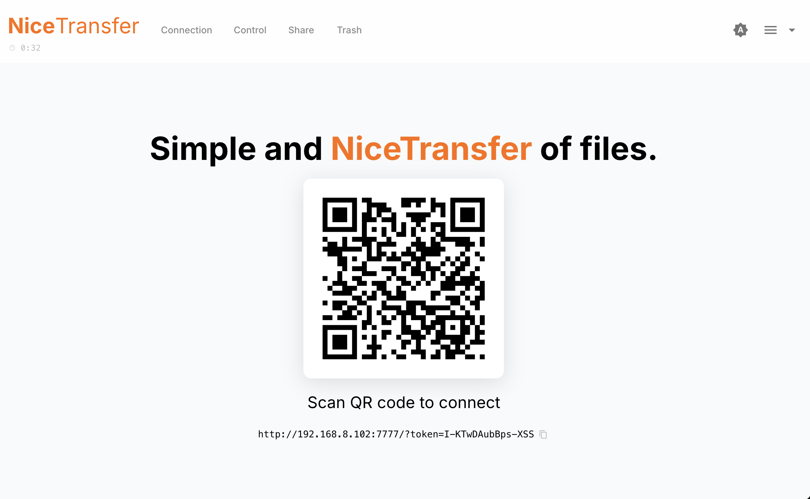
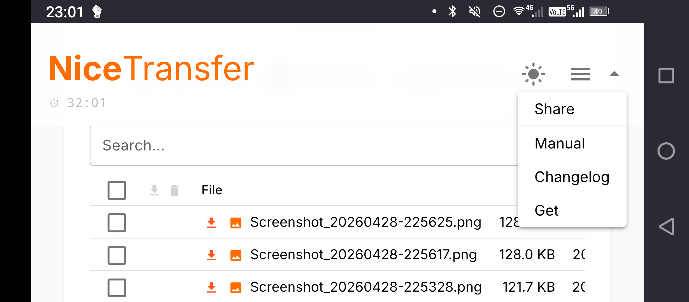
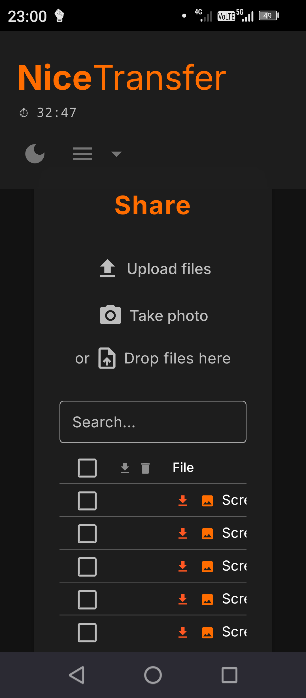

# nicetransfer

Nice and simple local file transfer via browser.

Start the server, scan the QR code on any device on your network, and transfer files instantly — no cloud, no app, no account.

## How it works

**Server device** — the computer running nicetransfer:
1. Run `./run.sh`
2. Open the local URL shown in the terminal (e.g. `http://127.0.0.1:7777/?token=...`) — the QR code and control panel appear

**Client device** — any phone, tablet, or computer on the same Wi-Fi:
1. Scan the QR code
2. The browser opens — upload, download, or share files immediately

Nothing to install on the client side.

→ [Full manual](MANUAL.md)

## Screenshots





## Installation

```bash
git clone https://github.com/joko-zauberzeug/nicetransfer
cd nicetransfer
chmod +x install.sh
./install.sh
./run.sh
```
